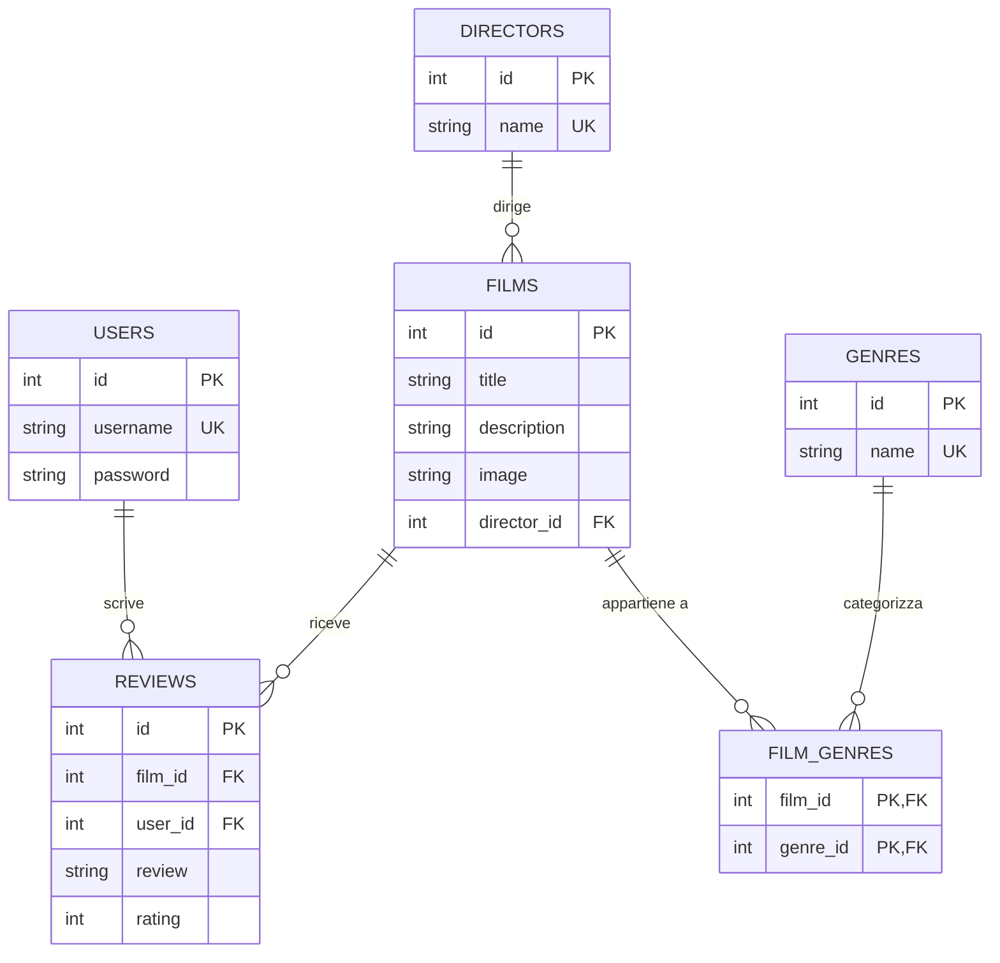

# Submarinium - Film Database

Un'applicazione web per la gestione e visualizzazione di film, con funzionalità di filtraggio per genere, recensioni utente e importazione automatica da TMDB.

## Diagramma ER


```
submarinium/
├── app.py                 # File principale dell'applicazione Flask
├── database.db            # Database SQLite
├── database_setup.py      # Script per inizializzare il database
├── README.md              # Documentazione del progetto
├── static/
│   ├── favicon/           # Contiene le immagini dei film
│   │   └── immaginesottomarino.png
│   ├── styles/
│   │    └── style.css      # Fogli di stile CSS
│   └── scripts/
│       └── filter.js       # Javascript per il filtro AJAX
└── templates/
    ├── layout.html        # Template base per tutte le pagine
    ├── index.html         # Homepage con lista film e filtri per genere
    ├── film.html          # Pagina dettaglio film con recensioni
    ├── director_films.html # Pagina con i film di un regista
    ├── login.html         # Pagina di login
    ├── register.html      # Pagina di registrazione
    ├── admin_import.html  # Pagina admin per importazione film
    └── debug.html         # Pagina di debug del database
```

### Requisiti del Sistema
#### Python 3.6 o superiore
#### Flask
#### SQLite3
#### Accesso a internet per l'importazione dei film
### Configurazione e Avvio
#### Installare le dipendenze: pip install flask requests
#### Inizializzare il database: python database_setup.py
#### Avviare l'applicazione: python app.py
#### Accedere all'applicazione tramite browser all'indirizzo: http://localhost:60001