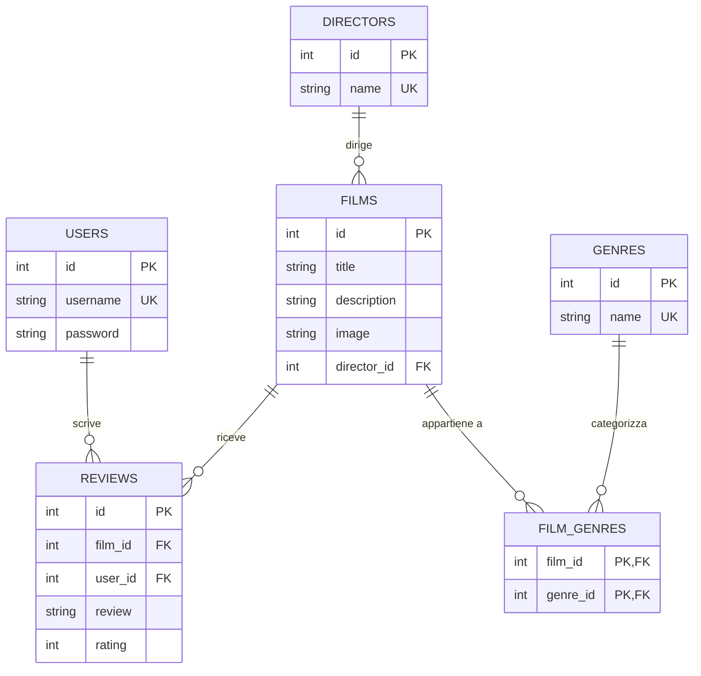

# progetto_finals

progetto_finals-1/
├── app.py                 # File principale dell'applicazione Flask
├── database.db            # Database SQLite
├── database_setup.py      # Script per inizializzare il database
├── Er-Diagram.md          # Documentazione del diagramma ER
├── static/
│   ├── favicon/           # Contiene le immagini dei film
│   │   ├── inception.png
│   │   ├── thematrix.png
│   │   ├── interstellar.png
│   │   ├── ...
│   │   └── immaginesottomarino.png
│   └── styles/
│       └── style.css      # Fogli di stile CSS
└── templates/
    ├── layout.html        # Template base per tutte le pagine
    ├── index.html         # Homepage con lista film e filtri per genere
    ├── film.html          # Pagina dettaglio film con recensioni
    ├── director_films.html # Pagina con i film di un regista
    ├── login.html         # Pagina di login
    └── register.html      # Pagina di registrazione