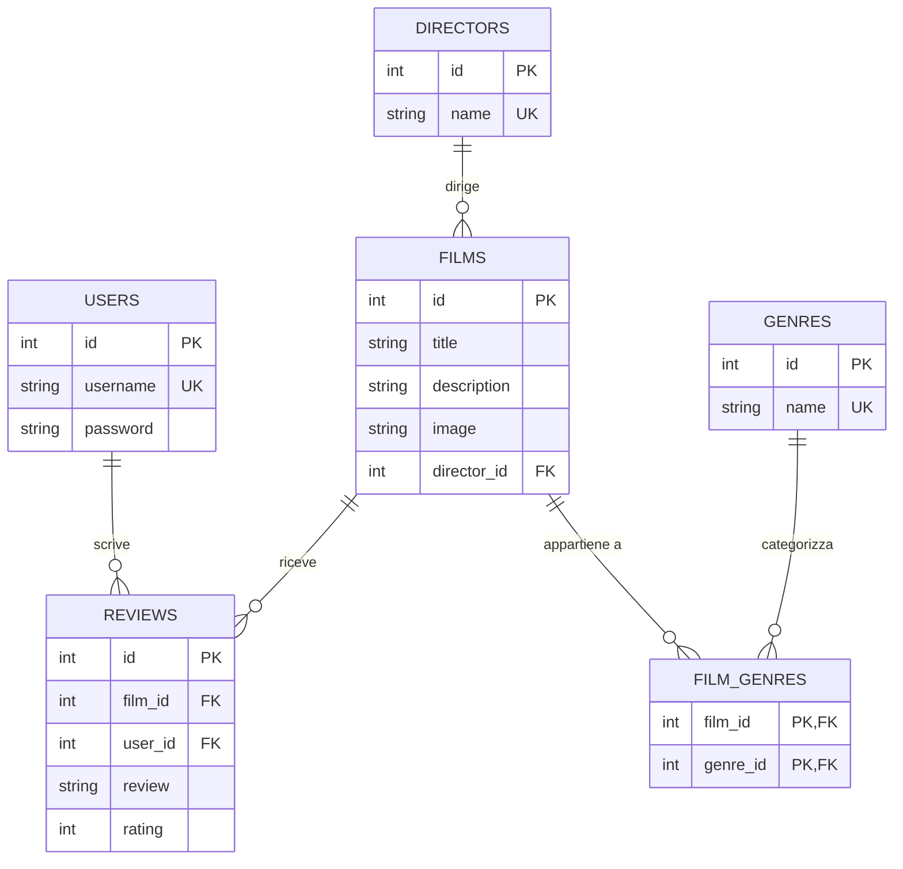

# 🎬 Submarinium - Piattaforma di Film Database

## 📋 Panoramica
Submarinium è una moderna applicazione web per la gestione e visualizzazione di un catalogo film, costruita con Flask e SQLite. La piattaforma offre un'esperienza completa per gli appassionati di cinema, con funzionalità avanzate di ricerca, filtraggio e valutazione.


## ✨ Funzionalità principali

- **Catalogo film** con poster, descrizioni e dettagli completi
- **Ricerca avanzata** con supporto per ricerca fuzzy e filtri multipli
- **Sistema di recensioni** che permette agli utenti di valutare i film (1-5 stelle)
- **Filtraggio per genere** in tempo reale tramite AJAX
- **Importazione automatica** da TMDB (The Movie Database) API
- **Interfaccia responsive** adatta a dispositivi desktop e mobile
- **Sistema di autenticazione** con registrazione e login utenti
- **Pannello amministrativo** per la gestione del catalogo

## 🗃️ Struttura del database

### Diagramma ER



## 📂 Struttura del progetto

```
submarinium/
├── flask_app.py           # File principale dell'applicazione Flask
├── database.db            # Database SQLite
├── database_setup.py      # Script per inizializzare il database
├── requirements.txt       # Dipendenze del progetto
├── README.md              # Documentazione del progetto
├── static/
│   ├── posters/           # Contiene le immagini dei film
│   ├── styles/
│   │    └── style.css     # Fogli di stile CSS
│   └── scripts/
│       └── filter.js      # Javascript per il filtro AJAX e ricerca
└── templates/
    ├── layout.html        # Template base per tutte le pagine
    ├── index.html         # Homepage con lista film e filtri per genere
    ├── film.html          # Pagina dettaglio film con recensioni
    ├── director_films.html # Pagina con i film di un regista
    ├── login.html         # Pagina di login
    ├── register.html      # Pagina di registrazione
    ├── admin_import.html  # Pagina admin per importazione film
    └── debug.html         # Pagina di debug del database
```

## 🛠️ Come funziona

1. **Inizializzazione del database**:
   - Il file `database_setup.py` crea il database SQLite con le tabelle necessarie
   - Genera automaticamente un utente admin (username: admin, password: admin123)
   - Importa automaticamente un set iniziale di film da TMDB se il database è vuoto

2. **Gestione delle immagini**:
   - I poster dei film vengono scaricati da TMDB e salvati localmente
   - I percorsi alle immagini sono memorizzati nel database

3. **Sistema di autenticazione**:
   - Gli utenti possono registrarsi e accedere all'applicazione
   - L'autenticazione è gestita tramite sessioni Flask

4. **Sistema di recensioni**:
   - Gli utenti autenticati possono lasciare recensioni e valutazioni
   - Il punteggio medio è calcolato in tempo reale

5. **Aggiornamento del catalogo**:
   - L'amministratore può importare nuovi film tramite l'interfaccia dedicata
   - Supporto per importazioni parziali (per pagine) o complete

6. **Ricerca e filtri**:
   - Ricerca in tempo reale con priorità di corrispondenza ottimizzata
   - Filtri per genere con aggiornamento AJAX della pagina

## ⚙️ Requisiti del sistema

- **Python 3.6 o superiore**
- **Pacchetti Python**:
  - Flask
  - Requests
  - GitPython (opzionale, per webhook di aggiornamento)
- **SQLite3**
- **Accesso a internet** per l'importazione dei film

## 🚀 Installazione e avvio

1. **Clona il repository**:
   ```bash
   git clone [URL-REPOSITORY]
   cd submarinium
   ```

2. **Installa le dipendenze**:
   ```bash
   pip install -r requirements.txt
   ```

3. **Inizializza il database**:
   ```bash
   python database_setup.py
   ```

4. **Avvia l'applicazione**:
   ```bash
   python flask_app.py
   ```

5. **Accedi all'applicazione**:
   - Apri il browser all'indirizzo: http://localhost:60001
   - Accedi come admin (username: admin, password: admin123)

## 🔧 Configurazione per il deployment

L'applicazione può essere facilmente deployata su servizi come PythonAnywhere:

1. Carica i file sul server
2. Configura il virtual environment con le dipendenze necessarie
3. Configura il percorso dell'applicazione WSGI
4. Verifica che le directory statiche abbiano i permessi corretti

## 👨‍💻 Sviluppo

Per contribuire al progetto:

1. Fai fork del repository
2. Crea un nuovo branch per la tua feature: `git checkout -b feature/nome-feature`
3. Committa le tue modifiche: `git commit -m 'Aggiunta nuova feature'`
4. Pusha il branch: `git push origin feature/nome-feature`
5. Apri una Pull Request

## 📝 Note

- Le password sono memorizzate in chiaro nel database per semplicità del progetto. In un ambiente di produzione, utilizzare l'hashing delle password.
- La chiave API TMDB è inclusa nel codice a scopo dimostrativo. In un ambiente di produzione, dovrebbe essere gestita come variabile d'ambiente.

## 📜 License

Questo progetto è distribuito con licenza MIT. Vedi il file `LICENSE` per i dettagli.